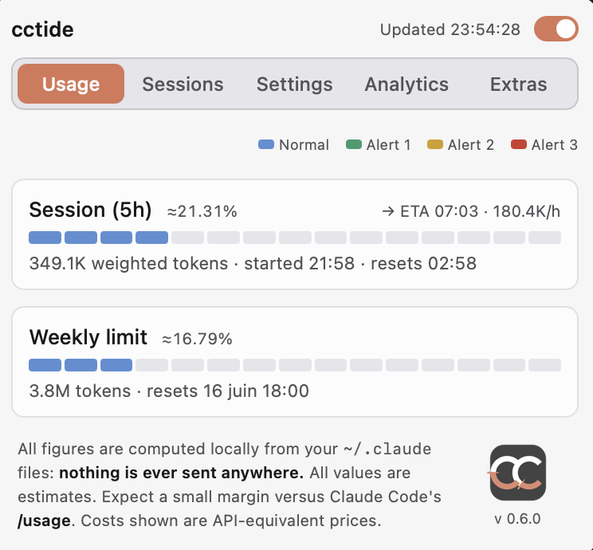
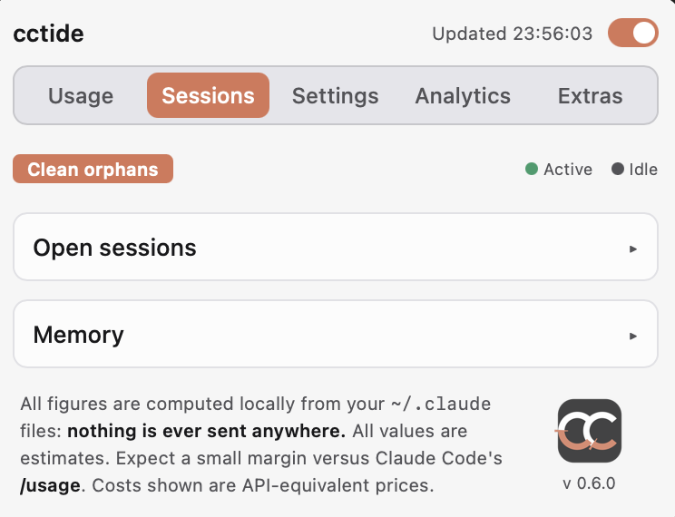
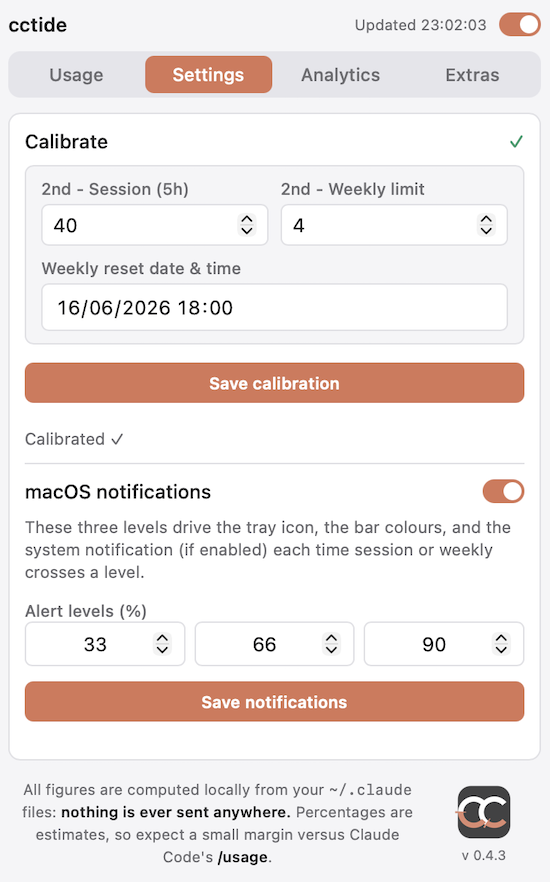
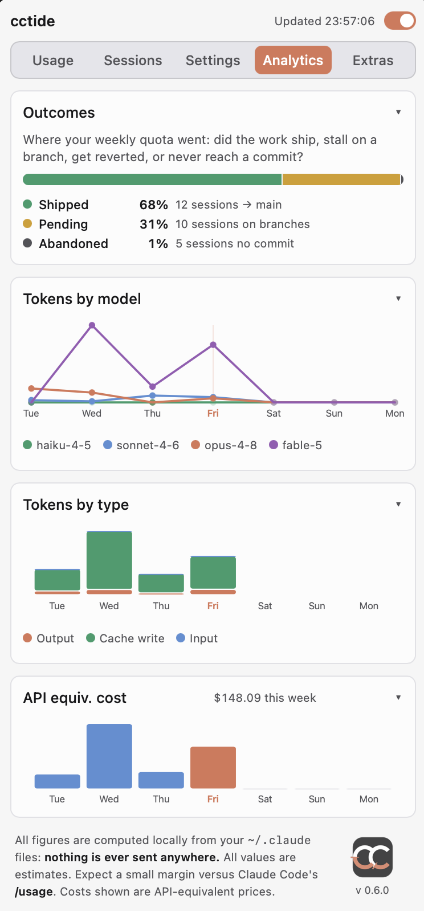
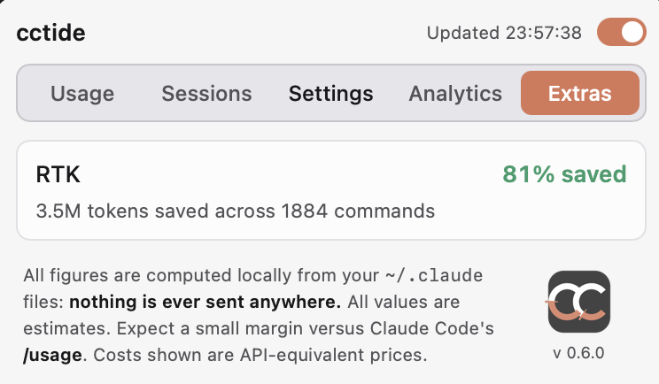

# cctide

<p align="center">
  <a href="https://github.com/jordan-temim/cctide/releases/latest"></a>
</p>

> [!IMPORTANT]
> **Running a build older than v0.9.1?** The update signing key was rotated, so auto-update can no longer verify new releases. **Download the latest build from [Releases](https://github.com/jordan-temim/cctide/releases/latest) and reinstall once** — afterwards auto-update works as usual.

<p align="center">
  
</p>

<p align="center">
  <a href="https://github.com/jordan-temim/cctide/actions/workflows/security.yml"></a>
  <a href="https://github.com/jordan-temim/cctide/actions/workflows/lint.yml"></a>
  <a href="https://github.com/jordan-temim/cctide/releases/latest"></a>
  <a href="https://github.com/jordan-temim/cctide/releases"></a>
</p>
<p align="center">
  <a href="https://github.com/jordan-temim/cctide/releases"></a>
  <a href="https://tauri.app"></a>
  <a href="https://github.com/jordan-temim/cctide/blob/main/LICENSE"></a>
  <a href="#no-credentials-ever"></a>
</p>

**Local Claude Code usage gauge — lives in the macOS menu bar.**

Track your session and weekly quota, open sessions' context windows, project memory, and RTK savings.

**Your usage data never leaves your machine — no Anthropic API, no telemetry, no analytics.**
**No credentials required — no API key, no session cookie, no keychain access.**

All data is read directly from `~/.claude`. The only network request cctide makes
is the update check to GitHub (see [Updates](#updates)) — no usage data is sent with it.

---

## What it shows

The panel is organized into **five tabs**:

| Tab                 | Sections                                       | What it tracks                                                                                                                                                                                                 |
| ------------------- | ---------------------------------------------- | -------------------------------------------------------------------------------------------------------------------------------------------------------------------------------------------------------------- |
| **Usage**     | Session (5h), Weekly limit                     | Rolling 5-hour quota and cumulative weekly usage, as 15-segment fuel gauges                                                                                                                                    |
| **Sessions**  | Open sessions, Memory                          | Each active Claude Code process' context fill (X / 200k), idle/active status, share of the 5h window, per-session actions (copy resume / close / delete); active sessions' project memory files                |
| **Settings**  | Calibrate, System notifications                | Anchor the bars to `/usage` once; configure three alert levels — drive segment colours, tray icon, and OS notifications                                                                                     |
| **Analytics** | Weekly window, Token types, API cost, Outcomes | Per-model token trend for the week, daily input/cache/output split, reference $ cost, and a classification of the week's quota spend by what the work became in git (shipped / pending / reverted / abandoned) |
| **Extras**    | RTK                                            | Tokens saved (shown only if `rtk` is installed)                                                                                                                                                              |

The session and weekly bars are **15-segment fuel gauges**. The menu-bar icon is live: two C-shapes fill with session (left) and weekly (right) usage, and blink at an escalating rate as levels are crossed. When an update is available a **"U"** appears in the right C (see [Updates](#updates)); development builds draw a **"D"** in the left C.

Every 60 seconds (configurable via `refresh_secs`), cctide re-reads the local JSONL files and a small notch briefly sweeps both C arcs — a visual confirmation that the data just refreshed. The same sweep also plays when you save a calibration, toggle tracking, or update alert levels. The notch is a transparent gap; it completes in about 2 seconds and has no effect on the displayed values.

### A look at each tab

<!-- Drop each screenshot in docs/ under the filename referenced below. -->

#### Usage

<p align="center"></p>

Two 15-segment fuel gauges, each colour-coded by your alert levels:

- **Session (5h)** — the rolling 5-hour window. Shows the percentage (to ~2 decimals), and underneath: the weighted-token total plus when the window *started* and when it *resets* (or "no activity in the current window"). The card header also estimates an **ETA to 100%** and the current **burn rate** (tokens/hour) while a session is active.
- **Weekly limit** — cumulative usage since your weekly anchor, with the weighted-token total and the **next reset** date/time.

#### Sessions

<p align="center"></p>

**Open sessions** — one row per running interactive Claude Code process (sub-agents are filtered out). Each row packs:

- a **status dot** (idle / active) and a **title** taken from the conversation's first prompt (falls back to the folder name);
- **badges** for the entrypoint (IDE / CLI) and the model;
- a context bar with **X / 200k ctx (NN%)** and, when known, that session's **share of the current 5h window**;
- **last activity** ("active 5m ago");
- per-session actions: **Copy resume** (`claude --resume <id>`), **Close** (SIGTERM) and **Delete** (removes the transcript) — both guarded by a two-step inline confirm, Delete showing a reinforced warning when the session has activity in the live 5h window. A **Clean orphans** button removes `sessions/<pid>.json` files left by dead processes.

**Memory** — a collapsible viewer of the active sessions' project memory files; expand to read a file, open it in your editor (↗), or delete it (✕, two-step) — which also drops its line from the `MEMORY.md` index.

#### Settings

<p align="center"></p>

- **Calibrate** — a status marker (● pending / ✓ done), the **session %** and **weekly %** fields, and a **reset-date** picker. Enter the values once from `/usage` and Save; the date field then shows your *next upcoming* reset.
- **System notifications** — an enable toggle plus the three **alert level** fields (default 33 / 66 / 90%). These levels drive everything at once: segment colours, the tray icon, and the OS notifications.

#### Analytics

<p align="center"></p>

Four sections covering the current 7-day window:

- **Weekly window** — a line chart of weighted tokens per day, one line per model family, with a marker on today and a legend; hover a point for the exact count.
- **Token types** — stacked daily bars splitting consumption into **output / cache write / input**.
- **API cost** — This is what the week's tokens *would* cost at Anthropic's public API list prices. It's informational only and has no bearing on your session/weekly quota.
- **Outcomes** (collapsible, lazy-loaded) — classifies the week's quota spend by what each session's work became in git: **Shipped**, **Pending**, **Reverted**, **Abandoned**, or **Non-repo**, as a segmented bar plus per-category % and session counts. Git is read strictly read-only.

#### Extras

<p align="center"></p>

**RTK** — if the Rust Token Killer proxy is installed, this shows the **average % saved** and the **total tokens saved across N commands**. The tab is disabled when the `rtk` binary isn't on this machine.

---

## Installation

> Builds are **unsigned** (no code-signing certificate). The OS will warn you on first launch — this is expected.

### Download a pre-built release

Pre-built binaries are available on the [**Releases page**](https://github.com/jordan-temim/cctide/releases/latest):

| Platform                      | File                       |
| ----------------------------- | -------------------------- |
| macOS (Intel + Apple Silicon) | `cctide-*-universal.dmg` |

See the macOS section below for first-launch instructions.

### Build from source

#### macOS — universal build (Intel + Apple Silicon)

Prerequisites: Xcode Command Line Tools, Rust with both Apple targets.

```sh
xcode-select --install
rustup target add aarch64-apple-darwin x86_64-apple-darwin
npm install
npm run build:mac
```

Output: `build/cctide-*-universal.dmg`

1. Open the `.dmg`, drag **cctide** into `/Applications`.
2. First launch — Gatekeeper will block the app (unsigned build). Two ways to allow it:
   - **System Settings → Privacy & Security → Security** (scroll down) → **Open Anyway**
   - **Terminal:**
     ```sh
     xattr -dr com.apple.quarantine /Applications/cctide.app
     ```
3. The icon appears in the **menu bar** (top right). Click to open.

> **Icon not showing while the app is running?** macOS gates menu bar icons
> per app: check **System Settings → Control Center → Allow in the Menu Bar**
> and make sure **cctide** is enabled. Dev builds run as a bare
> binary and get their **own entry** in that list (generic icon), separate
> from the installed app.

---

## Updates

cctide updates itself — **you stay in control of when**. It checks for a new
version at launch and every couple of hours while running. When one is available:

- a small **"U"** appears in the tray icon, and
- a banner shows at the top of the panel: **Update available: vX.Y.Z**, with a
  **What's new** link to the release notes.

Click **Install** to download it, then **Restart now** to apply. Nothing is
installed or restarted without your click.

> Auto-update works from the first release that shipped it onward. If you're on an
> older build, grab the latest `.dmg` from the
> [Releases page](https://github.com/jordan-temim/cctide/releases/latest) once.

---

## Troubleshooting

### The menu-bar / tray icon doesn't appear

- **macOS** gates menu-bar icons per app. Open **System Settings → Control Center → Allow in the Menu Bar** and make sure **cctide** is enabled. A dev build runs as a bare binary and gets its **own** entry there (generic icon), separate from the installed app — check both.
- The menu bar may be full: macOS silently hides overflow icons. Quit a few other menu-bar apps and relaunch.

### macOS says the app "is damaged" or "can't be opened"

This is Gatekeeper blocking the unsigned build, not actual corruption. Allow it once:

- **System Settings → Privacy & Security → Security** (scroll down) → **Open Anyway**, or
- in Terminal: `xattr -dr com.apple.quarantine /Applications/cctide.app`

### The bars show 0% or look wrong

- **Not calibrated yet** — the Calibrate indicator shows ● (pending). Run `/usage` in Claude Code and enter the session %, weekly %, and reset date once (see [First run](#first-run--calibrate-the-bars)).
- **Tracking is paused** — the header toggle is off (the tray icon shows a diagonal slash). Turn it back on.
- **No recent activity** — the 5h/weekly windows only count Claude Code turns inside the current window. An idle window legitimately reads near 0%.

### The percentages drifted from what `/usage` shows

cctide reconstructs the % locally, so small drift over a window is expected. Recalibrate once from a fresh `/usage` reading to re-anchor. Larger gaps usually mean:

- **You changed plans** (Pro ↔ Max) — recalibrate once; the new budget is captured automatically.
- **You deleted a transcript** that had activity in the current 5h window — the gauges under-count until the next reset. Recalibrate after the window rolls over.

### A session is missing from "Open sessions"

Only **running, interactive** Claude Code processes appear. Sub-agent processes are filtered out, and an entry disappears as soon as its process exits. Use **Clean orphans** to drop stale `sessions/<pid>.json` files left by dead processes.

### No macOS notifications

- Notifications need permission (requested at first launch). Check **System Settings → Notifications → cctide** and enable **Allow Notifications**.
- They surface reliably only from the **installed** build, not the bare `tauri dev` binary.
- The **System notifications** toggle (Settings tab) must be on. The tray icon still reacts to levels even when notifications are off.

### The Extras / RTK tab is missing

The RTK section only shows when the `rtk` binary is installed and on your `PATH`. Verify with `which rtk`.

### An update never appears, or won't install

Auto-update works only from the first release that shipped the updater onward. If you're on an older build, grab the latest `.dmg` from the [Releases page](https://github.com/jordan-temim/cctide/releases/latest) once — subsequent updates are then in-app.

---

## Uninstall

### macOS

Drag **cctide** from `/Applications` to the Trash — that removes the app.

To also remove the config file (calibration anchors, alert levels):

```sh
rm -rf ~/Library/Application\ Support/com.cctide
```

To remove the notification entry, go to **System Settings → Notifications**, find **cctide**, and delete it.

---

## First run — calibrate the bars

<p align="center"></p>

cctide reconstructs your quota locally from token weights. A single calibration point is all it needs.

1. In Claude Code, run `/usage` and note your **session %**, **weekly %**, and **weekly reset date**.
2. In cctide, open **Calibrate** (● means pending), enter those values, and click **Save**. The indicator turns ✓ and cctide starts tracking.

> **Reset date tip:** enter the date exactly as shown by `/usage` — past or future, any format accepted (`YYYY-MM-DD` or `YYYY-MM-DDTHH:MM`). cctide treats it as a recurring weekly anchor: once saved, the field shows your **next upcoming reset** (it rolls forward 7 days at a time), so you never see a stale past date.

After that, no further action is needed. If you change plans, recalibrate once.

### Plan-agnostic design

You don't tell cctide which plan you're on (Pro / Max 5× / Max 20×), and it never stores one.

The budget is derived from the % you report:

```
budget = tokens_so_far / (your_% / 100)
```

This automatically captures your plan's actual quota size — Pro users get a smaller budget, Max users a larger one, from the exact same calibration step. Per-model quota weights and the window mechanics (rolling 5h session, weekly reset) are identical across plans. If you switch plans, recalibrate once.

### How consumption is weighted

Tokens are weighted using **empirical quota weights** rather than API prices, then turned into a percentage by calibration. The weights live in `models.json` at the app root (compiled into the binary; nothing is written to `~/.claude`). Only the ratios matter — calibration absorbs the absolute scale — so you can edit them and rebuild if the quota mechanics seem to have changed.

These weights come from a **regression experiment**, and it's still evolving: across many sessions, each data point pairs the `/usage` % with the local token counts of that 5-hour window, and a **non-negative least-squares** (NNLS) fit looks for the weights that best reproduce the %, scored by **leave-one-window-out cross-validation** (LOWO-RMSE — hold out a whole session and predict it). The exact quota formula isn't public, so these remain **best-effort estimates** that may be refined as more data comes in.

### Context window

The "Open sessions" panel shows each active Claude Code process and how full its context window is. Some models can technically accept more than 200k tokens, but past roughly that point answer quality tends to degrade and each turn becomes far more token-hungry — so Claude Code works against an effective **~200k-token context** (compacting around there). cctide measures against that same 200k, so the percentage aligns with what `/context` shows in Claude Code.

---

## Alert levels & notifications

<p align="center"></p>

Three global alert levels (default **33 / 66 / 90%**, editable in the **macOS notifications** section) drive everything at once:

- **Segment colours** — neutral → green → orange → red as usage crosses each level
- **Tray icon** — blinks at an escalating cadence until you open the panel
- **OS notifications** — one notification per level crossing per bar, re-armed when the bar drops back below

The icon reacts independently of the notifications toggle.

---

## No credentials, ever

**cctide never queries Anthropic and never sends your data anywhere.** Most Claude usage trackers need a credential to query the API on your behalf — a browser session cookie extracted from DevTools, a session key stored in the system Keychain, or an OAuth token read from disk. That credential can expire, be revoked, or be accidentally exposed.

cctide takes a different approach: it reads the JSONL transcripts that Claude Code writes locally to `~/.claude`, and computes everything in-process. No cookie, no token, no Keychain entry, no Anthropic API call — there is nothing to leak or rotate. (The one exception is the update check to GitHub, which carries no usage data.)

The trade-off: because cctide never queries Anthropic's servers, the session and weekly percentages require a one-time manual calibration from `/usage`. After that, they track automatically.

---

## Privacy

cctide reads `~/.claude` files on disk and renders everything in-process. No usage data is sent anywhere and no analytics are collected. The only outbound request is the periodic update check to GitHub (to fetch `latest.json` and, if you choose to install, the new build) — it carries none of your data.

### What cctide reads and runs

Everything is local. Beyond reading files under `~/.claude`, cctide shells out to exactly two external binaries — both optional to the feature they back:

| Source                                | What                                                                                                                                                      | Used for                                             |
| ------------------------------------- | --------------------------------------------------------------------------------------------------------------------------------------------------------- | ---------------------------------------------------- |
| `~/.claude/projects/**/*.jsonl`     | Token-usage transcripts (read-only)                                                                                                                       | Session / weekly gauges, context fill, weekly charts |
| `~/.claude/sessions/*.json`         | Running-process metadata (read-only)                                                                                                                      | Open sessions list                                   |
| `~/.claude/projects/**/memory/*.md` | Project memory files (read, and delete on your action)                                                                                                    | Memory viewer                                        |
| **`git`** CLI                 | **Strictly read-only** — only `rev-parse`, `symbolic-ref`, and `log`. Never checks out, writes, or fetches; runs once per repo and is cached | Outcomes (Analytics tab)                             |
| **`rtk`** CLI                 | `rtk gain --format json` — only if the binary is on your `PATH`                                                                                      | RTK savings (Extras tab)                             |

If you don't open the Outcomes section, `git` is never invoked; if `rtk` isn't installed, the Extras tab stays empty. No other process is ever spawned.

---

## Development

### Architecture

cctide is built with **[Tauri v2](https://tauri.app)**: a Rust backend embedded in a native OS window, with a lightweight web frontend (Vite + vanilla TypeScript). There is no server, no runtime dependency, and no Electron-style bundled browser — the OS webview renders the UI.

**Backend (Rust — `src-tauri/src/`):**

- Reads and parses `~/.claude` files directly on disk (JSONL transcripts, session files, memory files)
- Computes usage windows, context fill, and model totals in-process
- Exposes results to the frontend via typed Tauri commands (`invoke`)
- Runs a background ticker thread (every 60 s by default) via `do_tick()` for live tray icon updates and threshold notifications; mutations trigger an immediate extra `do_tick` for instant feedback
- Persists app config (calibration anchors, alert levels, settings) to the OS config dir via `config.rs`

**Frontend (TypeScript — `src/`):**

- Organized into separate tab modules: `tab-usage`, `tab-sessions`, `tab-settings`, `tab-analytics`, `tab-extras`
- Listens to `refresh` events emitted by the backend ticker; uses `invoke` only for mutations and lazy section loads (memory)
- Renders the segmented gauge bars, open session context bars, and model breakdown
- No framework — vanilla TypeScript with direct DOM manipulation and tab routing

**Model data (`models.json`):**

- Compiled into the binary at build time via `include_str!`
- Two weight sets per model: **$/MTok prices** (reference only) and **empirical quota weights** (the `quota` block — what actually drives the %), plus context window
- Edit and rebuild to update the quota mechanics, prices, or add new models

### Running tests

```sh
# Rust unit tests (usage math, model lookup, scan filtering, config validation)
cargo test --manifest-path src-tauri/Cargo.toml

# TypeScript typecheck
npx tsc --noEmit

# Frontend unit tests (Vitest)
npm test
```

The Rust test suite covers the core business logic: session/weekly window calculation, calibration math, model entry lookup (longest-match), quota weighting, JSONL dedup filtering, and config sanitisation. The frontend suite (Vitest) covers pure helpers such as the weekly-reset rollover (`nextWeeklyReset`).

### Running locally

```sh
npm install
npm run tauri dev      # hot-reload dev build
```

### Commit convention

This project follows [Conventional Commits](https://www.conventionalcommits.org/):

```
<type>(<optional scope>): <description>
```

| Type         | When                                 |
| ------------ | ------------------------------------ |
| `feat`     | New user-facing feature              |
| `fix`      | Bug fix                              |
| `ci`       | CI/CD workflow changes               |
| `docs`     | Documentation only                   |
| `refactor` | Code change with no behaviour change |
| `test`     | Adding or updating tests             |
| `chore`    | Maintenance with no dedicated type   |
| `style`    | Formatting only (rustfmt, etc.)      |
| `build`    | Build system / dependencies          |
| `perf`     | Performance improvement              |

Examples: `feat: add weekly models breakdown` · `fix(scan): dedupe by message id` · `ci: bump actions to node 24`

### Project layout

```
src/                  Frontend (Vite + vanilla TypeScript)
  main.ts             App entry point + tab routing
  tab-usage.ts        Usage tab (session/weekly bars)
  tab-sessions.ts     Sessions tab (open sessions + actions + memory)
  tab-settings.ts     Settings tab (calibration + notifications)
  tab-analytics.ts    Analytics tab (weekly chart + outcomes)
  tab-extras.ts       Extras tab (RTK)
  types.ts            Shared TypeScript types
  update.ts           Update logic
  utils.ts            DOM helpers
src-tauri/src/
  lib.rs              Tauri plugins, tray, window, module wiring
  commands.rs         Tauri command handlers
  state.rs            Shared app state
  tick.rs             Background ticker (refresh loop)
  update_svc.rs       Update check/install/restart
  scan.rs             JSONL discovery, parsing, mtime cache + dedup
  usage.rs            5h window + weekly calibration math
  context.rs          Per-session context window fill
  outcome.rs          Edit-fate classification via read-only git (Outcomes)
  models.rs           Per-model data loader (models.json)
  notify.rs           Threshold-crossing native notifications
  icon.rs             Live CC-gauge tray icon renderer
  config.rs           Persisted config (calibration, settings)
  memory.rs           Memory file reader
  rtk.rs              RTK integration (optional)
models.json           Per-model quota weights + prices + context window (edit to update)
```

---

## Disclaimer

See [DISCLAIMER.md](DISCLAIMER.md).

---

## License

MIT — see [LICENSE](LICENSE).
